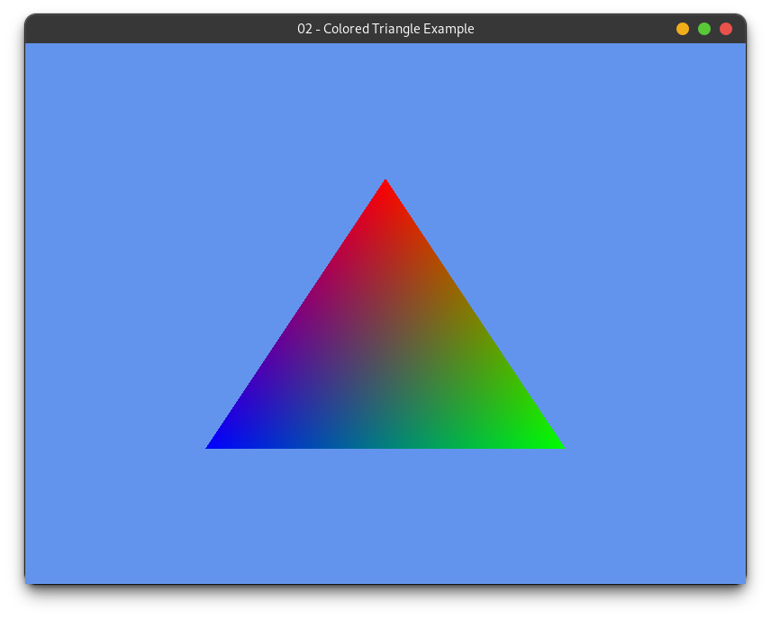
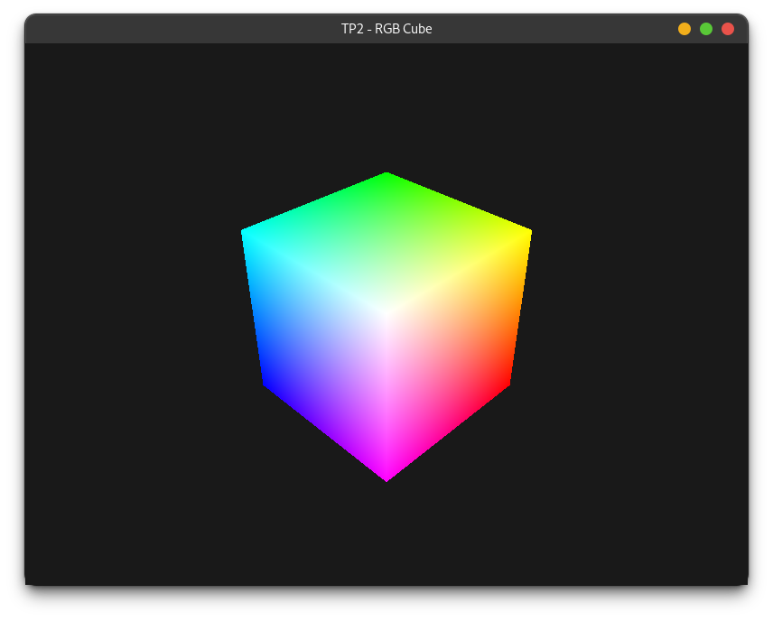

# TP2 : Rendu graphique avec le pipeline Vulkan

## Objectifs

Ce TP introduit le **pipeline graphique Vulkan** et son utilisation pour afficher des primitives à l'écran. Vous allez apprendre à :

- Créer une fenêtre et initialiser un device graphique avec une swapchain
- Configurer un graphics pipeline (vertex shader + fragment shader)
- Acquérir une image de la swapchain et la présenter à l'écran
- Passer des données de géométrie au GPU via des storage buffers (**vertex pulling**)

---

## Contexte : le pipeline graphique Vulkan

Le pipeline graphique transforme des données de géométrie en pixels affichés à l'écran. Il enchaîne plusieurs étapes fixes et programmables :

```
Vertex Shader --> Rasterisation --> Fragment Shader --> Framebuffer
  (par sommet)                       (par fragment)
```

Les deux étapes **programmables** sont écrites en GLSL :
- Le **vertex shader** (`*.vert`) est exécuté une fois par sommet. Il calcule la position du sommet en coordonnées clip (`gl_Position`) et transmet des données interpolées au fragment shader.
- Le **fragment shader** (`*.frag`) est exécuté une fois par fragment. Il calcule la couleur finale écrite dans le framebuffer.

### La swapchain et la boucle de rendu

La **swapchain** est une file d'images tampons entre le GPU et l'écran. Chaque frame, on **acquiert** une image, on y **dessine**, puis on la **présente**. La synchronisation entre ces étapes est assurée par des **sémaphores**.

```
[Acquérir image] --> [Enregistrer commandes] --> [Soumettre] --> [Présenter]
       ^                                                               |
       |_______________________________________________________________|
                           (frame suivante)
```

### Les objets spécifiques au rendu

| Objet | Rôle |
|---|---|
| `GraphicsPipeline` | Pipeline avec vertex + fragment shader |
| `SwapChainImage` | Image de la swapchain à rendre puis présenter |
| `DynamicRenderingContext` | Démarre/termine le rendu sur une image cible avec une couleur de fond |
| Sémaphores | Synchronisation entre acquisition, rendu et présentation |

---

## Compilation et exécution

```bash
# Depuis le dossier realtimerendering-students/
mkdir build && cd build
cmake ..

make TP2_exo1
./TP2_exo1
```

---

## Exercice 1 : Premier triangle (`src/TP2/exo1.cpp`)


### Objectif

Afficher un triangle RGB dans une fenêtre 800×600. Les positions et couleurs des sommets sont **définies directement dans le vertex shader** — aucune donnée géométrique n'est envoyée depuis le CPU.

### Shaders fournis

- `shaders/TP2/triangle.vert` : vertex shader avec 3 positions et couleurs codées en dur. Il utilise `gl_VertexIndex` pour sélectionner le sommet courant.
- `shaders/TP2/triangle.frag` : fragment shader qui transmet la couleur interpolée au framebuffer.

Ces deux fichiers sont fournis complets, ne les modifiez pas.

### Ce que vous devez implémenter

La création de la fenêtre, du device, des sémaphores et la structure de la boucle de rendu sont fournis. Complétez les 3 TODOs :

**TODO 1 — Acquérir l'image et démarrer le rendu** (dans la boucle, après le reset du command buffer) :

Acquérez la prochaine image de la swapchain, transitionez-la vers le layout d'attachement, puis démarrez le `DynamicRenderingContext` en spécifiant une couleur de fond de votre choix :

```cpp
LavaCake::SwapChainImage& swapchainImage =
    device.aquireSwapChainImage(imageAvailableSemaphores[currentFrame]);

swapchainImage.prepareForAttachementBarrier(cmdBuffer);

LavaCake::DynamicRenderingContext renderingContext =
    LavaCake::DynamicRenderingContext::Builder()
        .setRenderArea(device.getSwapchainExtent())
        .addColorAttachment(
            swapchainImage,
            vk::ClearColorValue(std::array<float, 4>{ r, g, b, 1.0f })
        )
        .begin(cmdBuffer);

renderingContext.setDefaultViewportScissor(cmdBuffer);
```

**TODO 2 — Créer le `GraphicsPipeline`** (en dehors de la boucle de rendu) :

```cpp
LavaCake::GraphicsPipeline graphicPipeline  = LavaCake::GraphicsPipeline::Builder(device)
    // Ajoute un vertex shader à partir d'une source
    .addShaderFromFile(root + "shaders/TP2/triangle.vert",vk::ShaderStageFlagBits::eVertex,LavaCake::ShadingLanguage::eGLSL)  
    // Ajoute un fragment shader à partir d'une source
    .addShaderFromFile(root + "shaders/TP2/triangle.frag",vk::ShaderStageFlagBits::eFragment,LavaCake::ShadingLanguage::eGLSL) 
    // Définit le format de l'image dans la quelle on va ecrire
    .addColorAttachmentFormat(device.getSwapchainFormat()) 
    // Affiche toutes les faces, y compris les back faces
    .setCullMode(vk::CullModeFlagBits::eNone) 
    .build();

```

**TODO 3 — Lier le pipeline et dessiner** (dans le corps de la boucle, entre `setDefaultViewportScissor` et `renderingContext.end()`) :

```cpp
graphicPipeline.bind(cmdBuffer);
graphicPipeline.draw(cmdBuffer, 3);  // 3 sommets = 1 triangle
```

### Résultat attendu



---

## Exercice 2 : Vertex Pulling (`src/TP2/exo2.cpp`)

### Objectif

Remplacer les positions et couleurs codées en dur dans le vertex shader par des données stockées dans des **storage buffers GPU**, lues par le vertex shader via `gl_VertexIndex`.

Cette technique, appelée **vertex pulling**, donne un contrôle total sur la disposition des données en mémoire GPU et est de plus en plus répandue en rendu moderne.

### Shader à écrire

Le fragment shader `shaders/TP2/triangle.frag` est réutilisé tel quel.

Écrivez `shaders/TP2/triangle2.vert` **depuis zéro**. Ce shader doit :

- Déclarer deux storage buffers en lecture seule : positions `vec2[]` (binding 0) et couleurs `vec3[]` (binding 1)
- Lire la position et la couleur du sommet courant via `gl_VertexIndex`
- Écrire `gl_Position` et transmettre la couleur au fragment shader

> **Note** : utilisez l'extension `GL_EXT_scalar_block_layout` et le qualificatif `scalar` pour les layouts de buffers afin d'éviter les problèmes d'alignement mémoire entre C++ et GLSL.

### Ce que vous devez implémenter

La solution de l'exercice 1 est fournie. Complétez les 4 TODOs :

1. **Buffers GPU** — créez `positionBuffer` et `colorBuffer` depuis les vecteurs CPU `position` et `color` fournis, avec l'usage `eStorageBuffer`.

2. **Descriptor set** — créez un `DescriptorSetLayout` (2 bindings storage buffer accessibles depuis le vertex stage), un `DescriptorPool`, allouez un descriptor set et liez les deux buffers.

3. **Pipeline** — utilisez `triangle2.vert` au lieu de `triangle.vert` et ajoutez le descriptor set layout au builder avec `.addDescriptorSetLayout(...)`.

4. **Draw** — avant l'appel à `draw()`, liez le descriptor set :
   ```cpp
   graphicPipeline.bindDescriptorSets(cmdBuffer, {descriptorSet});
   ```

### Résultat attendu

Le même triangle RGB qu'en exercice 1 (voir ci-dessus), mais avec les données géométriques provenant des buffers GPU.

### Pour aller plus loin

Modifiez les vecteurs `position` et `color` dans `exo2.cpp` pour changer la forme ou les couleurs du triangle. Essayez d'afficher deux triangles en passant 6 sommets à `draw()`.

---

## Exercice 3 : Cube RGB en 3D — Uniform Buffer (`src/TP2/exo3.cpp`)

### Objectif

Passer à la 3D en affichant un cube dont les 8 sommets sont colorés selon les axes RGB. On introduit la transformation **Model-View-Projection** transmise au shader via un **uniform buffer**, et un **depth buffer** pour gérer l'occlusion entre faces.

### Concepts nouveaux

**Matrice MVP** : chaque sommet est transformé par trois matrices successives.

```cpp
gl_Position = Projection × View × Model × position_locale
```

| Matrice | Rôle |
|---|---|
| **Model** | Place l'objet dans le monde |
| **View** | Simule la caméra |
| **Projection** | Projette la scène 3D en 2D |

```cpp
glm::mat4 view       = glm::lookAt(glm::vec3(2,2,2), glm::vec3(0,0,0), glm::vec3(0,1,0));
glm::mat4 projection = glm::perspective(glm::radians(45.0f), 800.0f/600.0f, 0.1f, 100.0f);
projection[1][1] *= -1.0f; // correction axe Y Vulkan
glm::mat4 mvp = projection * view * model;
```

**Uniform Buffer** : transmet des données constantes à un shader, optimisé pour les petites structures lues uniformément par toutes les invocations.

```cpp
LavaCake::UniformBuffer mvpUbo(device);
mvpUbo.addVariable("mvp", mvp);
mvpUbo.end();
// Dans la boucle :
mvpUbo.update(cmdBuffer);
```

**Depth Buffer** : stocke la profondeur de chaque fragment pour rejeter les fragments cachés.

```cpp
LavaCake::Image depthImage(device, width, height, 1,
    vk::Format::eD32Sfloat,
    vk::ImageUsageFlagBits::eDepthStencilAttachment);
LavaCake::ImageView depthView(depthImage, vk::ImageViewType::e2D,
    vk::ImageAspectFlagBits::eDepth);
// Pipeline : .setDepthAttachmentFormat(eD32Sfloat).setDepthTest(true)
// Contexte : .setDepthAttachment(depthView, 1.0f)
```

### Shader à écrire

Écrivez `shaders/TP2/cube.vert` **depuis zéro**. Il doit :
- Activer `GL_EXT_scalar_block_layout` et utiliser le qualificatif `scalar` sur les storage buffers — par défaut (`std430`), un `vec3` est aligné sur 16 octets comme un `vec4`, ce qui corrompt la lecture d'un tableau `vec3[]` uploadé depuis le CPU. Avec `scalar`, chaque élément est stocké à sa taille naturelle (12 octets pour un `vec3`), identique à la disposition mémoire de `glm::vec3` en C++.
- Déclarer 3 storage buffers (positions `vec3[]`, couleurs `vec3[]`, indices `uint[]`) et 1 uniform buffer (`mvp`)
- Lire l'indice via `indices[gl_VertexIndex]`, récupérer position et couleur
- Calculer `gl_Position = mvp * vec4(position, 1.0)`

Le fragment shader `shaders/TP2/cube.frag` est fourni.

### Ce que vous devez implémenter

La géométrie du cube (8 sommets, 36 indices) est fournie. Complétez les 6 TODOs :

**TODO 1** — Créer trois storage buffers : `posBuffer`, `colBuffer`, `idxBuffer`.

**TODO 2** — Calculer la matrice MVP et créer l'`UniformBuffer`.

**TODO 3** — Créer le `DescriptorSetLayout` (3 storage + 1 uniform), le pool, allouer et mettre à jour le descriptor set.

**TODO 4** — Créer l'image de profondeur et sa vue.

**TODO 5** — Créer le `GraphicsPipeline` avec `cube.vert` / `cube.frag`, depth test et back-face culling activés.

**TODO 6** — Dans la boucle : uploader l'UBO, créer le `DynamicRenderingContext` avec color et depth attachments, binder le pipeline, dessiner 36 sommets.

### Résultat attendu



---

## Exercice 4 : Animation — Push Constants (`src/TP2/exo4.cpp`)

### Objectif

Animer le cube en rotation. La matrice MVP est décomposée : `viewProj` (statique) dans l'uniform buffer, et `model` (dynamique) envoyée à chaque frame via un **push constant**.

### Concept : Push Constants

Les **push constants** permettent d'envoyer de petites données directement dans le command buffer, sans passer par un buffer GPU. Idéal pour des données qui changent à chaque frame.

**Limite :** 128 octets garantis (= 2 `mat4`) sur tout hardware Vulkan.

```cpp
// Déclaration dans le pipeline :
.addPushConstantRange(vk::ShaderStageFlagBits::eVertex, 0, sizeof(glm::mat4))

// Envoi dans la boucle :
pipeline.pushConstants(cmdBuffer, vk::ShaderStageFlagBits::eVertex, 0, model);
```

```glsl
layout(push_constant) uniform PushConstants { mat4 model; } pc;
```

### Shader à écrire

Écrivez `shaders/TP2/cube2.vert` en partant de `cube.vert` :
- Remplacez l'uniform `mvp` par un uniform `viewProj`
- Ajoutez un `layout(push_constant)` contenant `mat4 model`
- Adaptez le calcul : `gl_Position = viewProj * pc.model * vec4(position, 1.0)`

### Ce que vous devez implémenter

Les buffers et le descriptor set (identiques à l'exercice 3) sont fournis. Complétez les 3 TODOs :

**TODO 1** — Ne plus calculer une MVP globale : calculer `viewProj = projection * view` et le stocker dans l'`UniformBuffer`.

**TODO 2** — Modifier le pipeline pour utiliser `cube2.vert` et ajouter le push constant range.

**TODO 3** — Dans la boucle, calculer `model = glm::rotate(...)` à chaque frame et l'envoyer via `pushConstants` avant le draw.

### Résultat attendu

Le même cube qu'en exercice 3 (voir ci-dessus), mais tournant en continu autour de l'axe Y.
