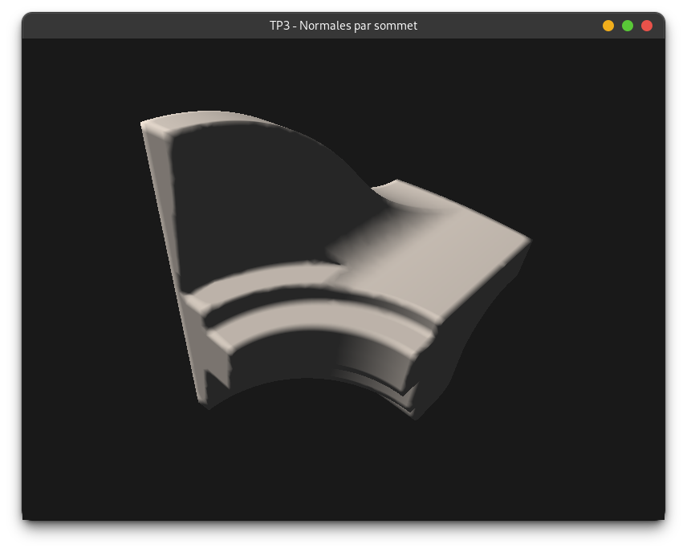
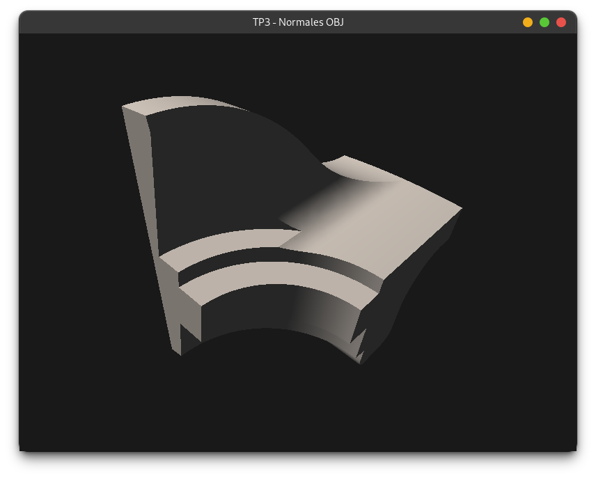

# TP3 — Normales et éclairage de Lambert

## Objectifs

- Charger un modèle 3D depuis un fichier `.obj`
- Calculer des **normales par face** et des **normales par sommet** à partir de la géométrie
- Comprendre la différence visuelle entre les deux approches
- Implémenter l'**éclairage de Lambert** dans un fragment shader

---

## Concepts clés

### Format OBJ et chargement minimal

Le chargeur `loadModel` fourni dans `utils/ObjLoader.hpp` accepte plusieurs surcharges. Pour ces exercices on utilise la version minimale qui ne charge que les positions et les indices :

```cpp
#include "utils/ObjLoader.hpp"

std::vector<float>    positions;
std::vector<uint32_t> positionIndices;

loadModel(root + "models/fandisk.obj", root + "models/",
          positions, positionIndices);
```

Les normales ne sont **pas** fournies par le fichier OBJ dans cette version : elles doivent être calculées à partir de la géométrie.

---

### Normale de face

La normale d'un triangle est le vecteur perpendiculaire à son plan. Elle se calcule par **produit vectoriel** de deux arêtes :

```cpp
glm::vec3 n = glm::normalize(glm::cross(v1 - v0, v2 - v1));
```

Pour un modèle avec `N` triangles, on stocke `N` normales (une par triangle) dans un tableau `perFaceNormals` de taille `positionIndices.size() / 3`.

Dans le shader, la normale du fragment courant est celle du triangle auquel il appartient. Le triangle d'un sommet `gl_VertexIndex` est à l'indice `gl_VertexIndex / 3` :

```glsl
vec3 normal = normals[gl_VertexIndex / 3];
```

**Résultat visuel :** les arêtes entre triangles sont visibles (facettes nettes).

---

### Normale par sommet

En accumulant les normales des faces adjacentes à chaque sommet puis en normalisant, on obtient une normale lissée par sommet. Le rendu semble alors continu, sans facettes.

```cpp
std::vector<glm::vec3> perVertexNormals(positions.size() / 3);

for (uint32_t t = 0; t < positionIndices.size(); t += 3) {
    glm::vec3 n = glm::normalize(glm::cross(v1 - v0, v2 - v1));
    perVertexNormals[i0] += n;
    perVertexNormals[i1] += n;
    perVertexNormals[i2] += n;
}
for (auto& n : perVertexNormals) { n = glm::normalize(n); }
```

Les normales partagent les mêmes indices que les positions. Le shader utilise l'indice de position pour lire la normale :

```glsl
uint posIdx = posIndices[gl_VertexIndex];
vec3 normal = normals[posIdx];
```

---

### Éclairage de Lambert

Le modèle de Lambert calcule l'intensité lumineuse diffuse comme le cosinus de l'angle entre la normale de surface et la direction de la lumière :

```glsl
vec3  lightDir = normalize(vec3(1.0, 2.0, 1.0));
float diffuse  = max(dot(normalize(normal), lightDir), 0.0);
float ambient  = 0.15;
outColor = vec4(vec3(diffuse + ambient), 1.0);
```

---

## Construction

```bash
cd realtimerendering-students
cmake -B build
cmake --build build --target TP3_exercice1
./build/TP3_exercice1
```

---

## Exercice 1 — Normales par face

L'objectif est d'afficher le modèle `fandisk.obj` éclairé avec des **normales calculées par triangle** (une normale par face).

### Étapes

**TODO 1 — Calculer les normales par face**

Créez un vecteur de `glm::vec3` qui stoquera la normal de chaque face. Pour chaque triangle  récupérez les 3 vertices depuis `positions`, calculez la normalà l'aide de `glm::cross` et `glm::normalize`, stockez dans `perFaceNormals`.

**TODO 2 — Buffers GPU**

Créez trois storage buffers : `posBuffer` (positions), `nrmBuffer` (perFaceNormals), `posIdxBuffer` (positionIndices).

**TODO 3 — Uniform Buffer MVP**

Même logique que les exercices précédents : view + projection + correction axe Y Vulkan, `UniformBuffer` avec la variable `mvp`.

**TODO 4 — Descriptor Set**

Créer un descriptor set qui contiendra les positions les normals, et les indices des vertex de chaque triangle.

**TODO 5 — Pipeline**

Utilisez `shaders/TP3/perFaceNormal.vert` et `shaders/TP3/obj.frag`. Activez depth test et back-face culling.

**TODO (boucle)** — Mettre à jour la MVP avec `glm::rotate` à chaque frame, uploader l'UBO, dessiner `positionIndices.size()` sommets.

### Résultat attendu


### Shaders GLSL

**`shaders/TP3/perFaceNormal.vert`** : à écrire depuis zéro (voir le commentaire dans le fichier).

**`shaders/TP3/obj.frag`** : fourni. Il attend une `fragNormal` interpolée à `location = 0` et applique l'éclairage de Lambert.

---

## Exercice 2 — Normales par sommet

Partez de l'exercice 1. L'objectif est de remplacer les normales par face par des **normales lissées par sommet** calculées par accumulation, et d'observer la différence visuelle.

### Étapes

**TODO 1 — Calculer les normales par sommet**

La normale du sommet $v_i$ est définie comme la moyenne des normales des faces qui le contiennent :

$$\hat{n}(v_i) = \frac{\displaystyle\sum_{t_j \ni v_i} n(t_j)}{\displaystyle\sum_{t_j \ni v_i} 1}$$

Contraintes :
 - Pour limiter la complexité, faites en sorte de ne calculer qu'une seule fois la normale de chaque triangle
 - Pour limiter l'utilisation mémoire, faites en sorte de ne pas stocker la normale des triangles
 - Pour limiter l'utilisation mémoire, faites en sorte de ne pas stocker le nombre de triangles auquel participe chaque point

**TODO 2 — Buffers GPU**

Même structure qu'en exercice 1, mais `nrmBuffer` contient `perVertexNormals`.

**TODO 3–5 — UBO, Descriptor Set, Pipeline**

Identiques à l'exercice 1. Utilisez `shaders/TP3/perVertexNormal.vert` à la place de `perFaceNormal.vert`.

**TODO (boucle)** — Identique à l'exercice 1.

### Shader GLSL

**`shaders/TP3/perVertexNormal.vert`** : à écrire en partant de `perFaceNormal.vert` (voir le commentaire dans le fichier). Seule la lecture de la normale change.

### Résultat attendu



### Comparaison

Lancez les deux exercices côte à côte et observez la différence :
- Exercice 1 : facettes visibles, discontinuités aux arêtes
- Exercice 2 : surface lisse, transitions douces entre triangles

---

## Exercice 3 — Normales issues du fichier OBJ

### Pourquoi les normales calculées ne suffisent pas toujours ?

L'exercice 2 lisse **toutes** les arêtes du modèle sans distinction. C'est correct pour une surface organique (personnage, terrain), mais incorrect pour un objet à arêtes vives (cube, pièce mécanique, architecture) : les angles droits disparaissent et la forme perd sa lisibilité.

La solution est de laisser l'artiste décider quelles arêtes sont lisses et lesquelles sont vives. Le format OBJ supporte cela en stockant des normales explicites avec des **indices indépendants** des indices de position. Un même sommet peut ainsi avoir des normales différentes selon la face à laquelle il appartient.

```
Position 7 (coin du cube) :
  face top   → normalIndices[i] = 0  →  normals[0] = (0, 1, 0)
  face front → normalIndices[j] = 1  →  normals[1] = (0, 0, 1)
  face right → normalIndices[k] = 2  →  normals[2] = (1, 0, 0)
```

### Ce que vous devez implémenter

**TODO 1 — Buffers GPU**

Le chargement est fourni. Créez quatre storage buffers :
- `posBuffer` — positions
- `nrmBuffer` — normals (normales issues du fichier OBJ)
- `posIdxBuffer` — positionIndices
- `nrmIdxBuffer` — normalIndices

**TODO 2 — Uniform Buffer MVP**

Identique aux exercices précédents.

**TODO 3 — Descriptor Set**

Layout avec 4 storage buffers + 1 uniform buffer (bindings 0 à 4).

**TODO 4 — Pipeline**

Utilisez `shaders/TP3/objNormal.vert` et `shaders/TP3/obj.frag`. Activez depth test et back-face culling.

**TODO (boucle)** — Identique aux exercices précédents.

### Shader GLSL

**`shaders/TP3/objNormal.vert`** : à écrire depuis zéro. La différence clé avec l'exercice 2 est que les normales ont leurs propres indices :

```glsl
uint posIdx = posIndices[gl_VertexIndex];
uint nrmIdx = normalIndices[gl_VertexIndex];   // indice distinct !
vec3 position = positions[posIdx];
vec3 normal   = normals[nrmIdx];
```

### Résultat attendu



### Comparaison finale

Lancez les trois exercices côte à côte sur un modèle qui contient des arêtes vives :
- Exercice 1 : facettes nettes sur toutes les faces
- Exercice 2 : tout est lissé, les arêtes vives disparaissent
- Exercice 3 : lissage là où l'artiste l'a voulu, arêtes vives préservées
